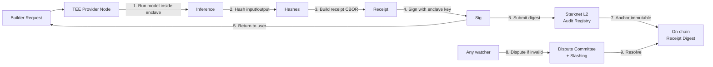

# Patronaige

**Finance Your AI Workforce. Pay With Upside.**

Patronaige is a verifiable inference capital allocation platform that proves AI compute was executed correctly — using TEE receipts (Phase 1) and zero-knowledge proofs (Phase 2). Builders get compute financing; patrons get exposure to AI-native revenue.

---

## The Moat

Most AI compute markets are unverifiable. You either trust the provider or you don’t. Patronaige removes that trust assumption:

- **Receipts are signed in hardware** (AWS Nitro enclaves or Intel SGX) before the result leaves the enclave.
- **Receipt digests anchor on-chain** (Starknet L2) — immutable audit trail.
- **Disputes are slashing-backed** — anyone can challenge a bad receipt; honest challengers get rewarded.

This turns “compute as a service” into **“compute as a verifiable financial instrument.”**

That’s the moat: **proof‑backed capital**. Unlike GPU marketplaces that just list capacity, we prove output correctness and tie it to economics.

---

## Architecture



**Components:**

1. **Builder Client** — sends prompt, receives completion + full receipt
2. **Provider Daemon** — runs inside TEE; produces signed receipts
3. **Audit Registry (Cairo)** — on-chain contract that anchors receipt digests, handles disputes
4. **Dispute Committee** — randomly selected from staked providers; adjudicates challenges
5. **Frontend (React/Vite)** — dashboard to monitor compute, view receipts, manage stakes

---

## Phase 1 — TEE Receipts (Now)

**Objective:** Production‑ready verifiable compute using hardware enclaves.

### Key Artifacts

| Artifact | Location | Status |
|----------|----------|--------|
| Audit Layer Spec | `specs/AUDIT-LAYER-SPEC.md` | Complete |
| Receipt Format | `specs/RECEIPT-SPEC.md` + `receipt.schema.json` | Final |
| Verification Contract (Cairo) | `contracts/Verification.cairo` | Draft |
| Provider Daemon (TS stub) | `provider/daemon.ts` | Mock mode |
| Frontend (Docs) | `docs/` (built) | Deploying |

### Receipt Flow

```
Request → Enclave → Inference → Hash I/O → Build CBOR → Sign (enclave key) → Return
                                                                  ↓
                                                          Anchor digest on L2
```

**Receipt fields:**
- `model_id`, `input_hash`, `output_hash`, `provider_id`, `timestamp`, `metrics`, `attestation` (TEE report + CA chain)

**Anchoring:**
- Digest = `keccak256(cbor_canonical(receipt))`
- Batch 100 receipts → single L2 transaction (cost amortization)

**Dispute window:** 24–48 hours after anchoring. Any staked watcher can submit evidence (IPFS CID) and trigger slashing.

---

## Phase 2 — ZK‑Attested Inference (Research)

**Timeline:** 6–24 months

Replace TEE trust assumptions with cryptographic proofs. Use Lagrange DeepProve‑1 or custom zkLLM circuits to prove that `output = model(input)` without revealing model weights.

**Milestones:**
1. PoC with Llama 3.2 1B (quantized INT4)
2. Batching protocol (aggregate 100+ inferences into one proof)
3. Optimized gates for attention/layernorm
4. Dual‑track deployment (TEE for speed, ZK for high‑value)

See `specs/ZK-RESEARCH-TRACK.md`.

---

## Quickstart

### Run a provider (dev mode)

```bash
cd provider
npm install
npx ts-node daemon.ts "llama-3.2-1B" "Explain quantum entanglement simply"
```

This generates a mock receipt (signed with local ed25519 key). In production, the daemon runs inside an enclave and uses hardware‑backed keys.

### Validate a receipt

```bash
npm i ajv ajv-formats cbor
node -e "const v=require('./provider/validator'); v.validateReceipt(JSON.parse(process.argv[1]))" "$(cat receipt.json)"
```

### Deploy the Cairo contract

```bash
# Using starkli
starkli declare contracts/Verification.cairo --account $ACCOUNT
starkli deploy $CLASS_HASH --account $ACCOUNT
```

### Frontend

The PatronAIge frontend is built from `docs/`. Once Vercel deploys, visit your custom domain or https://karlostoteles.github.io/PatronAIge/.

---

## Economics

| Role | Action | Payout |
|------|--------|--------|
| **Builder** | Pays for inference + small verification fee | Receives compute, pays later (receipt‑backed revenue share) |
| **Provider** | Stakes capital, runs enclave, produces receipts | Earns usage fees, loses stake if proven fraudulent |
| **Challenger** | Watches chain, submits disputes when receipts invalid | Gets % of slashed stake as bounty |
| **Patron (Investor)** | Funds compute pool | Receives upside from builder revenue, protected by audit layer |

The system aligns incentives: providers have skin in the game, challengers are rewarded for vigilance, builders get non‑dilutive financing.

---

## Repository

- **Source:** https://github.com/karlostoteles/PatronAIge
- **Audit specs:** https://github.com/spiritclawd/patronaige
- **Docs site:** https://karlostoteles.github.io/PatronAIge/

---

## Status

- [x] Audit layer spec (TEE)
- [x] Receipt schema + CBOR spec
- [x] Verification contract (draft Cairo)
- [x] Provider daemon stub
- [x] Frontend ready for Vercel deploy
- [ ] AWS Nitro enclave integration
- [ ] Cairo contract audit
- [ ] Mainnet deployment

---

*Patronaige — where compute meets capital, provably.*